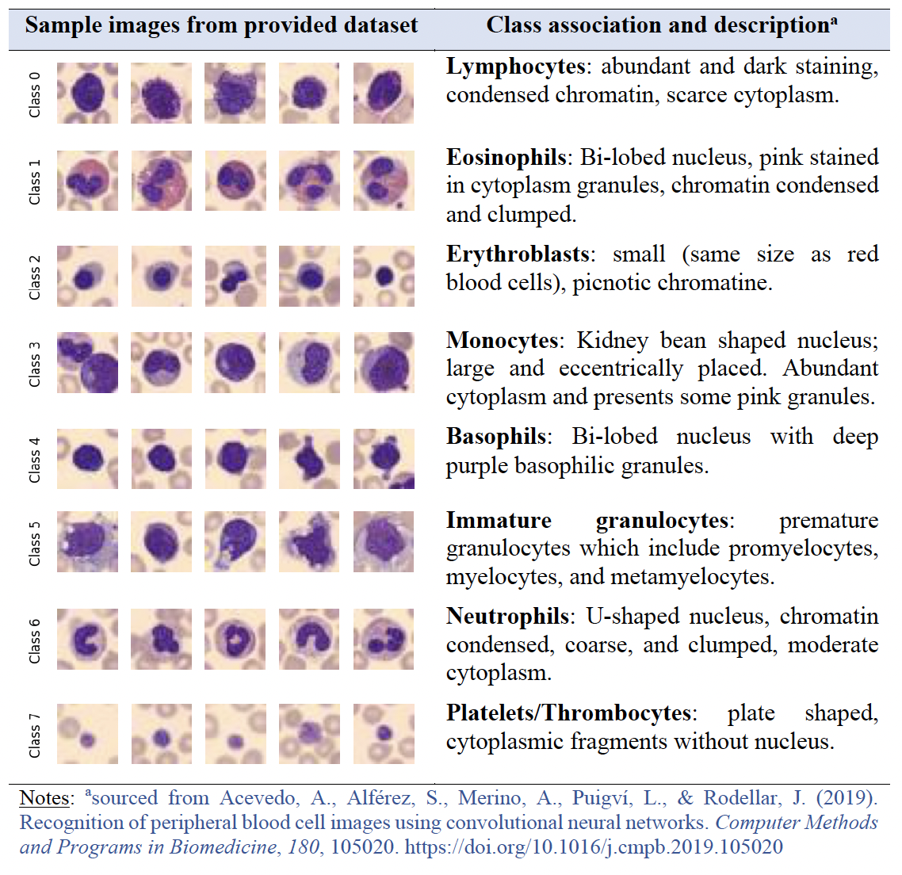
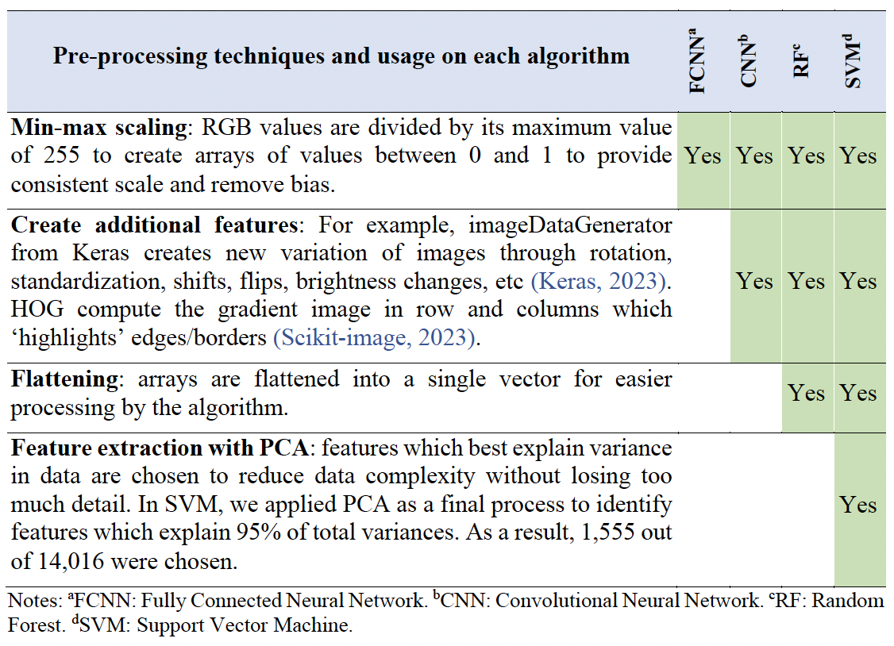
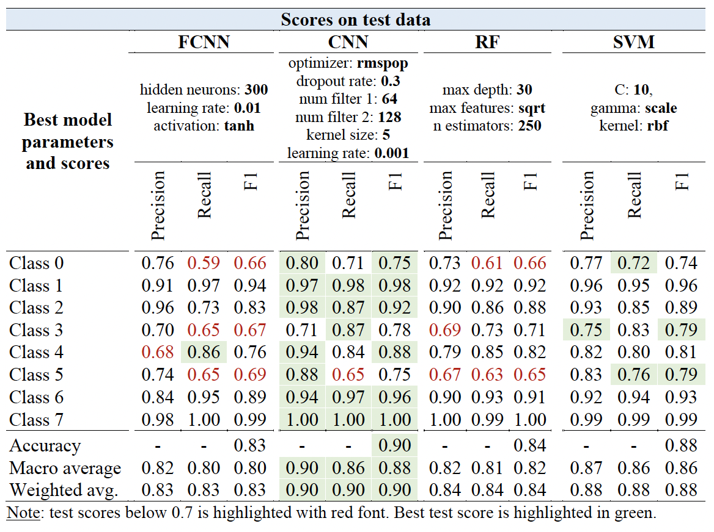

# Image Classification with BloodMNIST dataset

**PROJECT BACKGROUND**

This project is part of a series of assignments for COMP5318 - Machine Learning and Data Mining for the Masters Degree in Data Science at The University of Sydney. 

The aim of this study is to analyse machine learning methods in identifying andclassifying blood cell images into one of eight classes. Four algorithms are tested for appropriateness with performance measured by compiling speed, accuracy, and error rates. Our goal is to understand the benefits and drawbacks of each model, recommend a model which presents good balance of all performance metrices, and explain our recommendation.

## A. DATASET AND PRE-PROCESSING

The dataset consists of 17,000 images of blood cells. Each image is of size 27x27 pixels and are in RGB. Images are split into 8 classes with some level of imbalance. Please see image classification and relevant pre-processing strategies below. In general, neural network based methods require less pre-processing:

  
   
  Description of classes in BloodMNIST   
   

  
   
  Pre-processing steps for each method   
   

## B. METHODS OVERVIEW

Four different methods are explored in this project:

1. `Fully Connected Neural Network (FCNN)`: FCNN mimics the function of the brain which is composed of a stack of layers
of artificial neurons. FCNN receives raw data via the input layer which is then processed and transformed through a series of hidden layers and combined into a result at the output layer: 
    - Feedforward: information travels from input to output along the neural pathways (Geron, 2019).
    - Backpropagation: weights and biases are updated at every epoch by adjusting them against the calculated gradients (Geron, 2019).

2. `Convolutional Neural Network (CNN)`: CNN implements convolutional layers and pooling layers which allows the method to learn features/context effectively. CNN is much more efficient than FCNN and allows the construction of much deeper networks (Asopa, 2018).

3. `Random Forest (RF)`: RFs are a combination of tree predictors such that each tree depends on the values of a
random vector sampled independently and with the same distribution for all trees in the forest. The generalization error for forests converges a.s. to a limit as the number of trees in the forest becomes large. RF is robust at handling high dimensional data (Breiman, 2001). 

4. `Support Vector Machine (SVM)`: SVM is a machine learning algorithm which creates a hyperplane that best separates data
points (e.g., maximizes the margin of separation) of different classes. The hyperplane can be solved  efficiently using the kernel trick, whereby the dot product of a pair of vectors is calculated in a higher space, thus bypassing the need to compute the complex mathematical transformation of each vector from the original space. To ensure that SVM is able to generalize well with data that does not clearly fit the
separation by hyperplane, we can relax the algorithm by applying soft-margin, which
allows some degree of misclassification of data (e.g., data points lying on the wrong side of
the hyperplane) while still maximizing the margin of separation.

## C. RESULTS SUMMARY

<i> Please see full report for detailed hypertuning of each method. Displayed below is the overall best model(s) and the corresponding discussions.</i>

Best configuration for each method shown below, along with their class-specific scores. Convolutionary Neural Network (CNN) performs best amongst methods considered. 

  
   
  Tuning results
   

Taking run-times and accuracy scores into account, we recommend using a CNN for noisy image classification tasks. To further expand this study, we
recommend expanding the number of parameters tested, especially for neural network models,
to ensure that we find the global optimum solution and explore additional pre-processing
techniques for random forest and support vector machine to ensure data provided to the model
provides the best information on features. Specific recommendations are listed below:  
- `Fully connected neural network`: different designs of neural network, including different types of input layers, different types and number of hidden layers, and different types of output layers.  
- `Convolutional neural network`: altering the architecture by increasing the number of
convolution and pooling layers, additional hyperparameter values, including more
optimizer algorithms and a finer array of learning rates.
- `Random forest`: significantly expanding the number and range of hyperparameters tested
during grid search such as class_weight, max_leaf_nodes, bootstrap and min_samples_leaf
- `Support vector machine`: tweaking class_weight (e.g. giving more weight to less frequent
classes or classes that perform worse than others such as class 0), testing a finer array of C
values.

## D. REFLECTION 

Each algorithm has different use cases and trade-offs which should be considered. The choice
of algorithm must be matched with the goal of the exercise itself. More complex algorithm may
take longer to run and may not provide the best explanation/reasoning on feature importance.
Users need to consider what output needs to be generated to (i) measure the quality of the
model and (ii) provide useful insights when designing a model protocol. Simpler models may
provide adequate outputs with lower computational costs (e.g., shorter runtimes) given the right
pre-processing and design.

## H. REFERENCES

- Acevedo, A., Alferez, S., Merino, A., Puigvi, L., & Rodellar, J. (2019). Recognition of
peripheral blood cell images using convolutional neural networks. Computer Methods
and Programs in Biomedicine.  
- Acevedo, A., Merino, A., Alferez, S., Molina, A., Boldu, L., & Rodellar, J. (2020). A dataset
for microscopic peripheral blood cell images for development of automatic
recognition systems. Mendeley Data.  
- Asopa, S. I. (2018). Conceptual Understanding of Convolutional Neural Network- A Deep
Learning Approach. Procedia Computer Science, 679-688.  
- Balter, M. L., Leipheimer, J. M., Chen, A. I., Shrirao, A., Maguire, T. J., & Yarmush, M. L.
(2018). Automated end-to-end blood testing at the point of care: Integration of robotic
phlebotomy with downstream sample processing. Technology Volume 6 Number 2
(World Scientific), 59-66.  
- Breiman, L. (2001). Random Forests. Machine Learning.  
- Geron, A. (2019). Hands-On Machine Learning with Scikit-Learn, Keras, and TensorFlow :
Concepts, Tools, and Techniques to Build Intelligent Systems. O'Reilley.  
- Google. (2023). Google Foundational Courses. Retrieved from Google:
https://developers.google.com/machine-learning/data-prep/construct/samplingsplitting/
imbalanced-data  
- IBM. (2023). IBM. Retrieved from IBM: https://www.ibm.com/topics/neural-networks  
- Keras. (2023). Keras. Retrieved from Keras: https://keras.io/api/data_loading/image/  
- Scikit-image. (2023). Scikit-image. Retrieved from Scikit-image: https://scikitimage.
org/docs/dev/api/skimage.feature.html#skimage.feature.hog
- scikit-learn. (2023). Plot classification boundaries with different SVM kernels. Retrieved
from scikit-learn: https://scikitlearn.
org/stable/auto_examples/svm/plot_svm_kernels.html#sphx-glr-auto-examplessvm-
plot-svm-kernels-py
- scikit-learn. (2023). RBF SVM Parameters. Retrieved from scikit-learn: https://scikitlearn.
org/stable/auto_examples/svm/plot_rbf_parameters.html
- Tensorflow. (2023). Tensorflow. Retrieved from Tensorflow:
https://www.tensorflow.org/api_docs/python/tf/keras/preprocessing/image/ImageData
Generator
- The Centre for International Economics. (2019). The Economic Value of Pathology:
Achieving Better Health, and a Better Use of Health Resources. The Centre for
International Economics.
- Yang, J., Shi, R., Liu, Z., Zhao, L., Ke, B., Pfister, H., & Ni, B. (2023). MedMNIST v2 - A
large-scale lightweight benchmark for 2D and 3D biomedical image classification .
Scientific Data.
- Zheng, W., & Jin, M. (2020). The Effects of Class Imbalance and Training Data Size on
Classifier Learning: An Empirical Study. SN Computer Science.

